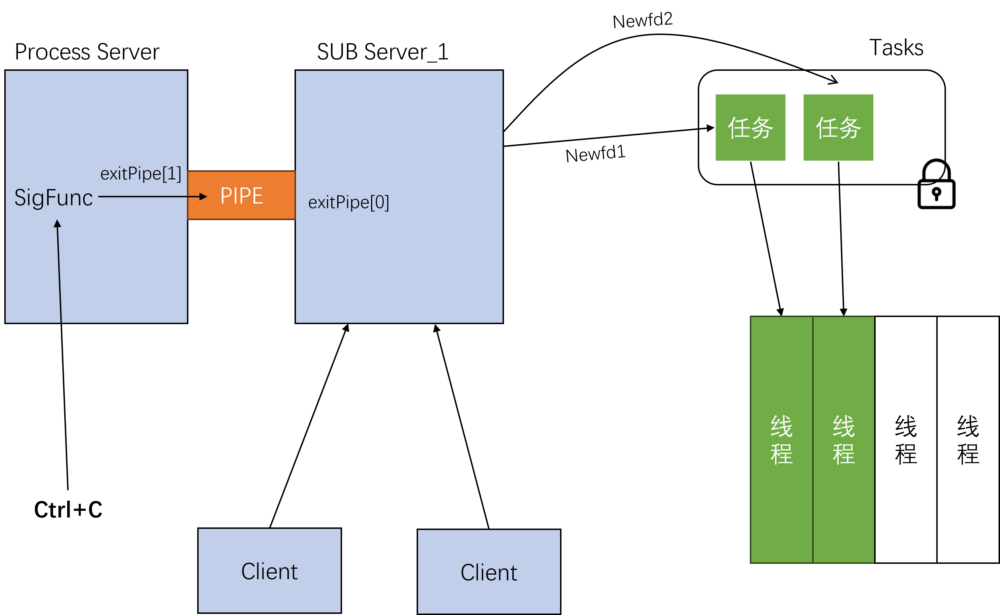

# netDisk

**高并发的远程网盘**:客户端远程访问可以查看文件目录，下载/上传文件。服务端高并发响应多个客户端的响应。

<!--  -->
<!--  -->

  

**服务端/客户端父子进程多线程架构**：

服务端退出：由于SIGUSR1(Ctrl+C)信号量对线程支持不好容易造成死锁，所以父进程fork得到子进程。父子进程通过管道通讯，父进程监听SIGUSR1(Ctrl+C)信号，当检测到信号时候通过管道发放消息给子进程。子进程监听pipe[0]设置线程池程序退出变量runningFlag，信号量唤醒等待线程然后退出线程，还在人物的线程任务完成后检测到退出变量则退出线程，子进程join得到所有线程结束，父进程wait等待子进程结束。

**高并发监听**：Epoll红黑数管理增加删除监听，O(1)检测就绪事件，对比就绪队列，监听socket当检测到就绪时候accept新的newfd添加到任务队列中。监听exitPipe[0]设置退出变量runningFlag。

**任务队列/线程池=生产者/消费者模型**：任务队列结构体包含任务头节点，尾节点，任务数量和信号量。当监听到新的客户端，上锁添加任务socket到任务队列通知等待线程，解锁。设计线程池，减少线程创建消灭以减少时间的消耗，我们在factory_s结构体中的存储线程数组的空间中创造numThread个线程，执行threadFun函数，每个函数保存一份客户端信息clientFd和独立当前路径currentPath，阻塞在wait，上锁判断任务数量如果等于0则等待信号量的唤醒，如果不等于0则取出任务，线程与客户端的newFd通讯，解锁。

**传输**：对于指令和短消息的传输设计train_s结构体包含datalength和buf字符数组。因为传输是流式的，所以先接受一个sizeof(int)的字符数组长度，再接受指定长度的字符数组数据，避免少读或者多读而造成数据偏移。为了读取length长度的数据可以使用参数WAITALL，或者封装send/recv函数得到sendn/recvn发送或者接受长度数据。sendTrain构建train结构体发送一整个train结构体也就是sizeof(int)长度和字符数据。sendFile和recvFiles首先发送/接受train文件名，然后循环传输文件内容train，send要添加NOSIGNAL避免客户端socket关闭而触发SIGPIPE而导致程序退出。 

**命令**：cd命令改变线程局部路径，ls返回当前路径下的文件，pwd显示当前路径，puts上传文件，gets下载文件，remove移除文件或者递归移除目录，tree返回树状文件。

## **开发中的问题**：

**1.**   **高并发下 send 报错，导致子线程异常退出**

背景：在高并发下，客户端有时候会突然断开，服务器线程还在 send。

遇到的问题：send 返回 -1，errno 是 EPIPE，线程直接因为收到 SIGPIPE 信号被杀死，导致线程池里面线程数量减少。

解决方法：给 send 加 MSG_NOSIGNAL 标志位。或者统一设置 signal(SIGPIPE, SIG_IGN); 忽略这个信号。

**2. 大文件传输中 TCP 粘包问题**

背景：实现网盘上传/下载功能，小火车协议。

遇到的问题：发送文件内容时出现粘包，导致客户端读到的数据出现偏移，文件内容错误。

解决方法：自定义传输协议，**每次发送一个"长度头" + "数据内容"**。客户端使用 recvn() 保证接收完整的指定长度数据。

**3. pthread_cleanup_push pthread_cleanup_pop**

该空间是一个局部空间，局部空间申明的变量无法在外部使用，查询后函数实现方式式宏替换，会产生一个花括号的局部作用域。